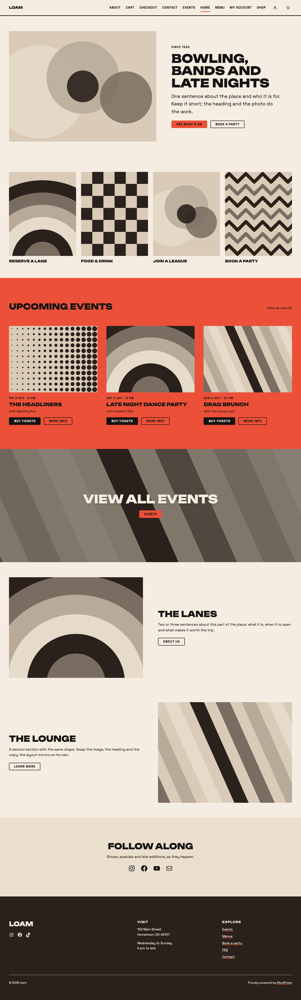
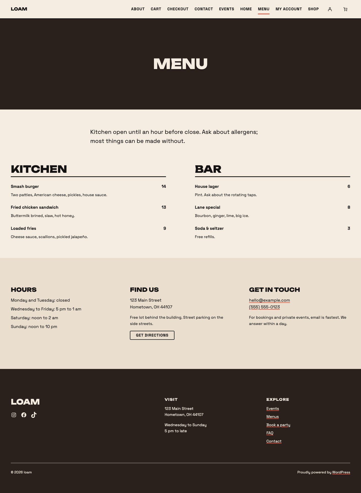
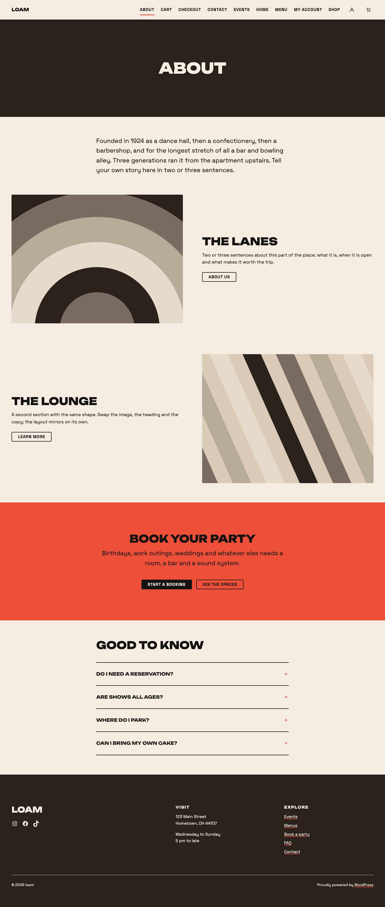
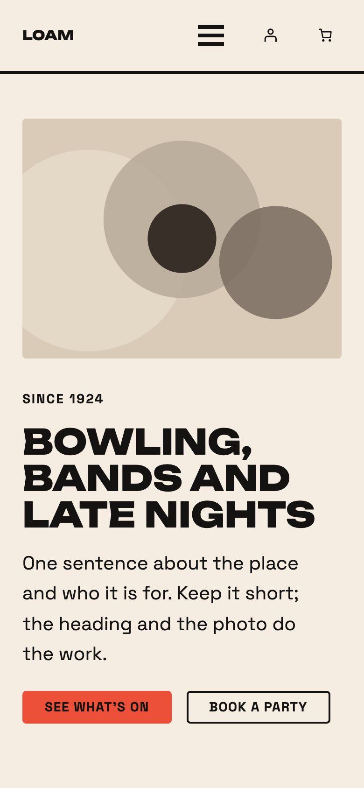
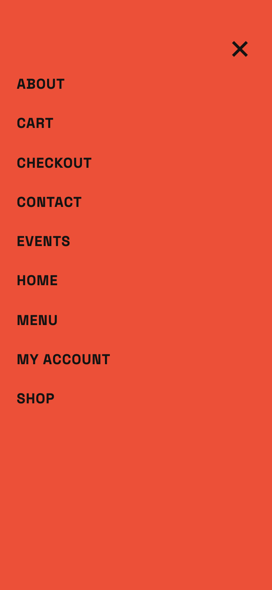
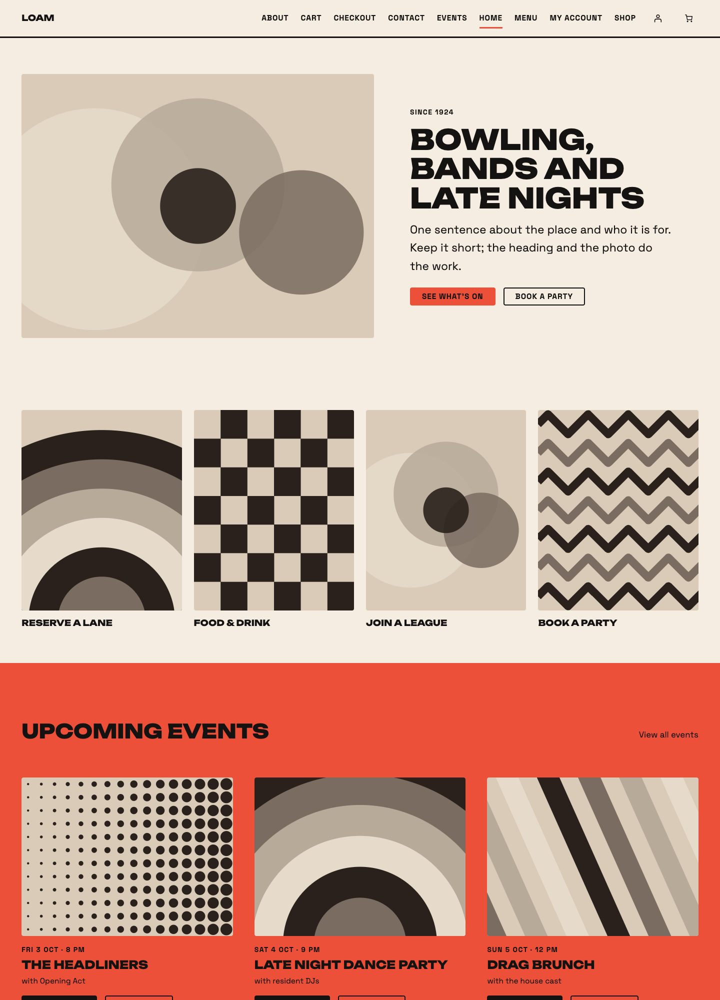
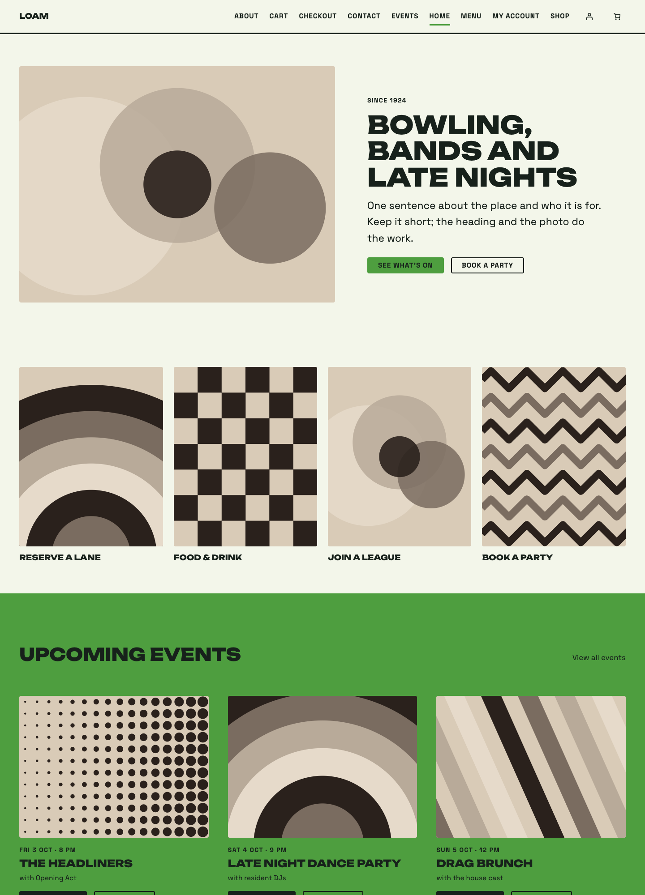
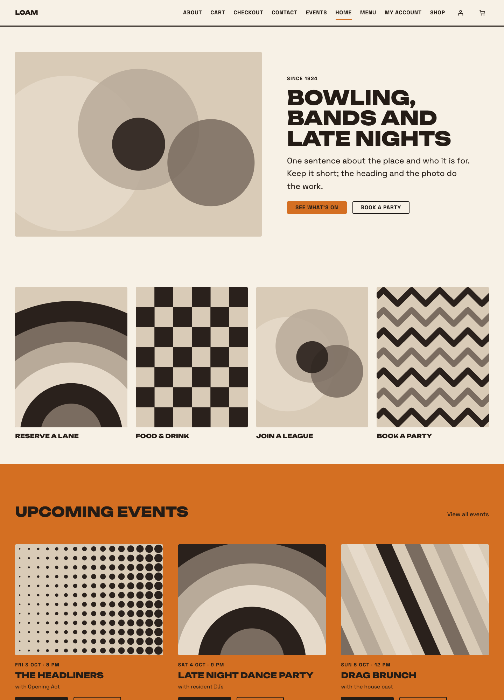
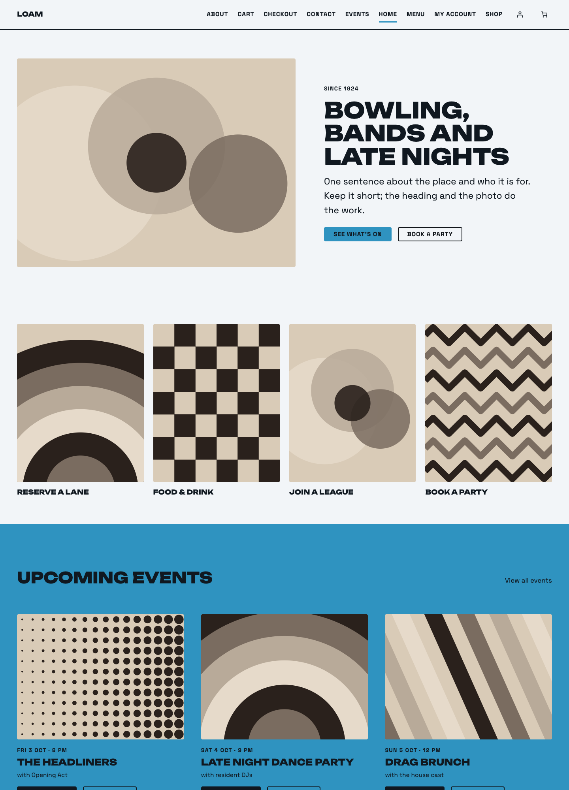

# Loam

[](https://playground.wordpress.net/?blueprint-url=https://raw.githubusercontent.com/philhoyt/loam/main/_playground/blueprint.json)

A block theme for venues, bars, bowling alleys and clubs: heavy uppercase headings,
chunky buttons, a cream ground with accent-coloured bands, and patterns for upcoming
events, signpost tiles, a food and drink menu, hours and location, and an FAQ. Four
seasonal colour presets (Summer, Spring, Autumn, Winter) and three section styles
restyle every band from Global Styles.

Colours, typography, spacing and layout widths live in `theme.json`. Templates and
template parts are thin block-markup shells; the block markup that matters lives in
PHP patterns under `patterns/`, so user-facing strings are translatable. Page starters
(Home, About, Events, Menu, Contact) compose the building blocks.

## Screenshots

The Home page starter, with the hero, signpost tiles, upcoming events, media bands and
footer:



| Menu                                                                                                                  | About                                                                                                                   |
| --------------------------------------------------------------------------------------------------------------------- | ----------------------------------------------------------------------------------------------------------------------- |
|  |  |

On a phone, with the menu closed and open:

 

The four colour presets, switched under Styles in the Site Editor:

| Summer (default)                                                                    | Spring                                                                              | Autumn                                                                              | Winter                                                                              |
| ----------------------------------------------------------------------------------- | ----------------------------------------------------------------------------------- | ----------------------------------------------------------------------------------- | ----------------------------------------------------------------------------------- |
|  |  |  |  |

## Requirements

- WordPress 6.9 or later (the FAQ pattern uses the core Accordion block)
- PHP 8.2 or later
- No plugins required. WooCommerce is optional: with it active, the theme's store
  templates and stylesheet load; without it, neither does.
- Node.js 22 and Composer are needed only for development.

## Installation

Download `loam.zip` from the
[latest release](https://github.com/philhoyt/loam/releases/latest), then in the admin go
to Appearance > Themes > Add New > Upload Theme, choose the zip and activate. The
Playground badge above starts a throwaway site with the theme and the demo pages already
in place.

## Usage

- Add a page and open the Pages tab of the pattern chooser for the Home, About, Events,
  Menu and Contact starters. Give the Home page the "Page (No Title)" template so the
  hero's heading is the only title, then set it as the front page under Settings >
  Reading.
- Pages and posts use their featured image as the masthead; without one they get a solid
  dark band.
- Colour and typography presets live under Styles in the Site Editor. The four colour
  presets share slugs, so switching between them keeps saved content intact.
- Apply the Accent, Dark or Tint section style to any Group, Columns or Cover to restyle
  it and everything inside it.
- With WooCommerce active, Loam's templates cover the shop, product category, tag and
  attribute archives, product search, single products, cart, checkout (with its own
  pared-back header and footer), My Account, order confirmation and the coming soon
  page. The My Account template applies to the page with the slug `my-account`.

## Development

The theme is symlinked into a Local site (`loam.local`); wp-env is the fallback.

```bash
npm install            # JS tooling, block validator
composer install       # phpcs, PHPStan
npx wp-env start       # fallback site at http://localhost:8894 with the theme active
npm run start          # compile SCSS from src/ to dist/ on change
npm run build          # production build (commit dist/ with any SCSS change)
npm run lint:js        # ESLint
npm run lint:scss      # Stylelint
npm run lint:php       # phpcs (WordPress coding standards)
composer analyse       # PHPStan
```

## Block markup

Templates, parts and patterns are hand-written block HTML. Markup that does not match
what the block's `save()` produces is rewritten or rejected by the editor. After editing
any of them run:

```bash
npm run validate:blocks
```

Done means the output ends with `All blocks valid.` Fix mismatches in the file; never
repair them from the Site Editor, which inlines the pattern and breaks translation.
The store templates use WooCommerce blocks, so WooCommerce must be active on the dev site
for the validator to recognise them. It checks their names and the core blocks inside
them, not their own wrapper markup; parse the templates in the Site Editor for that.
`npm run check:contrast` checks every colour preset against the contrast pairs the
bands rely on; `npm run patterns:flush` registers new pattern files on the dev site.

`npm run check:a11y` runs axe-core over every template of the running site (pass a base
URL; the default is the wp-env site) at a desktop and a phone width, with the phone
menu open, and fails on any WCAG 2.1 A/AA violation. It runs on every push in CI
against the demo content. Findings it cannot decide on its own are listed for a manual
pass with a keyboard and a screen reader.

## Releases

Run `/wp-release` in Claude Code, or do its steps by hand: bump `Version:` in
`style.css`, `version` in `package.json` and `Stable tag` in `readme.txt` together, add
the changelog entry, then push a matching `v`-prefixed tag:

```bash
git tag v1.0.0 && git push origin main --tags
```

The GitHub Actions workflow builds the assets, checks the tag against the three version
strings, zips the theme through `.distignore` with a single `loam/` root and attaches
`loam.zip` to the GitHub release. `dist/` is committed because neither that zip nor a
Theme Directory upload runs a build. Upload the same `loam.zip` to the Theme Directory;
refresh `screenshot.png` (1200×900, `npm run screenshot`) first if the home page has
changed.

## Limitations

- WordPress 6.9 is the floor because of the Accordion block; on older sites the FAQ
  pattern renders as plain content.
- All four colour presets are light. A dark preset would need the band roles rethought,
  because the section styles assume a light page ground.
- The Events grid is a Query Loop over posts; live ticketing feeds need a plugin.
- The Booking and Contact starters ship without a form.
- The WooCommerce styles were checked against WooCommerce 11.1. WooCommerce restyles its
  cart, checkout and mini cart between releases, so a later version may need selector
  updates in `src/styles/woocommerce.scss`.

## Credits

Unbounded and Space Grotesk are bundled under the SIL Open Font License; placeholder
artwork in `assets/images` is CC0. See `readme.txt` for the full copyright section.

## License

GPL-2.0-or-later. See https://www.gnu.org/licenses/gpl-2.0.html.
